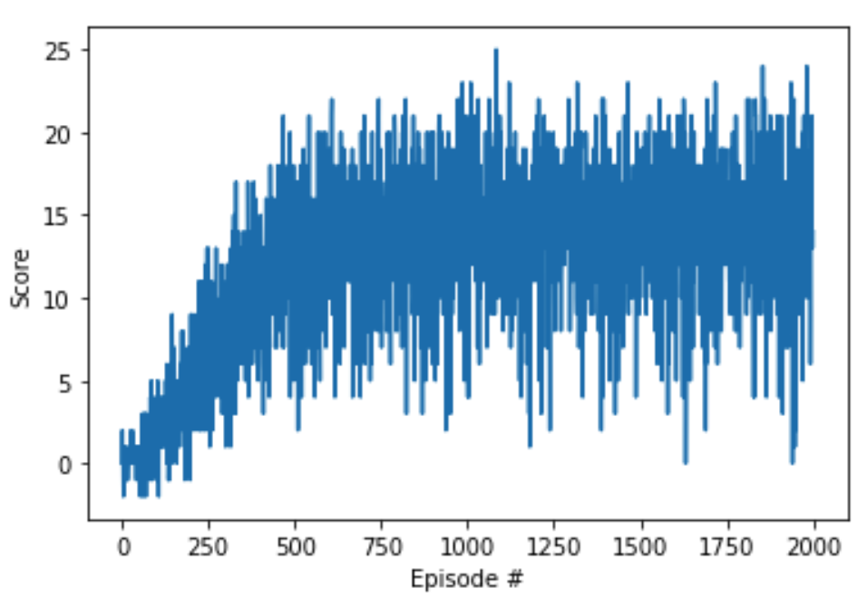
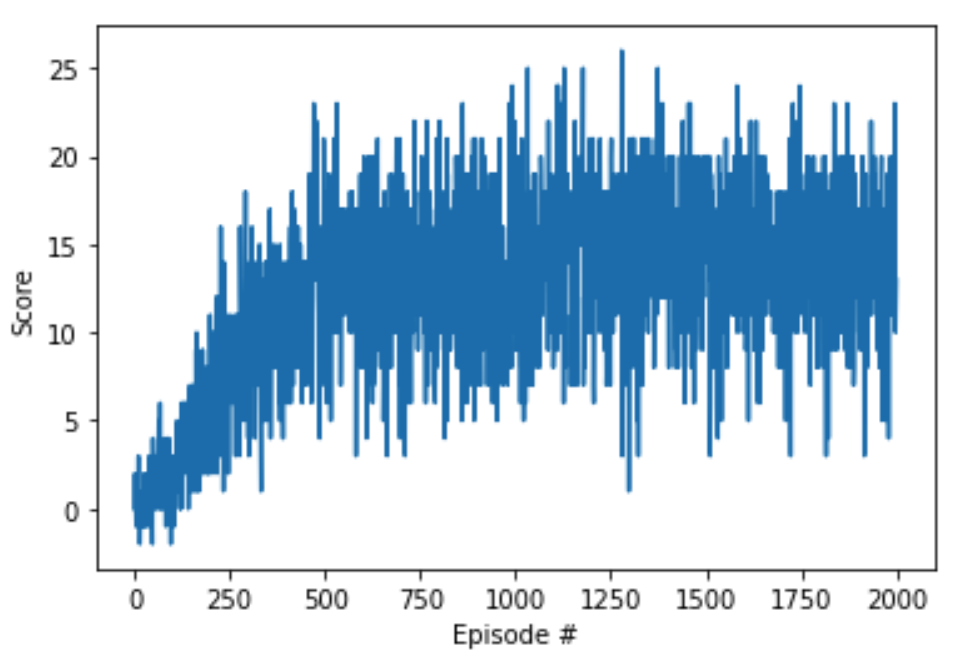
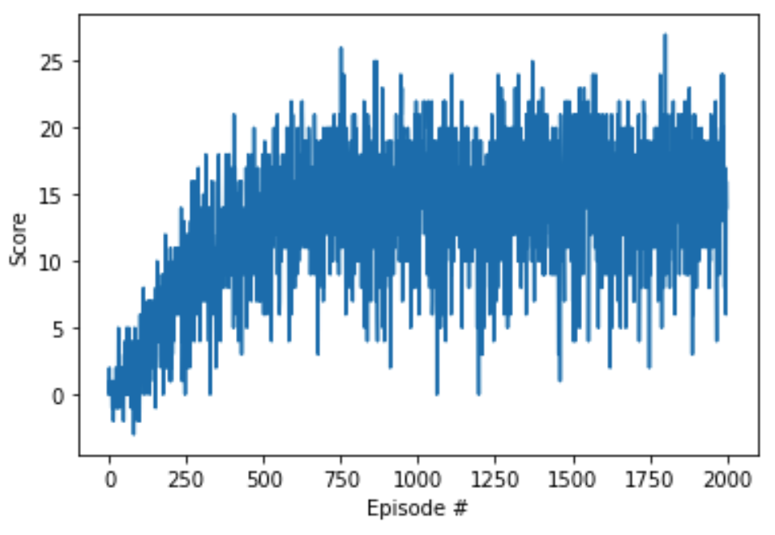
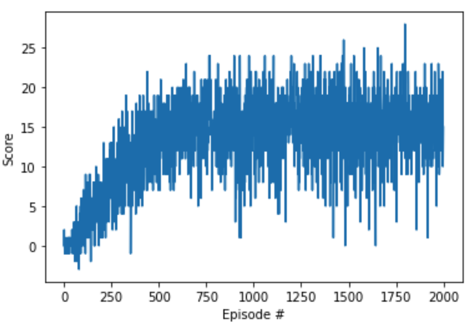
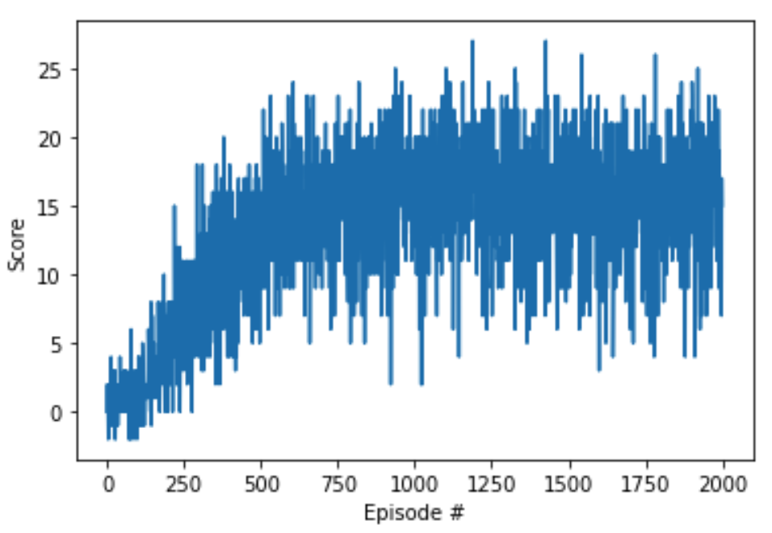
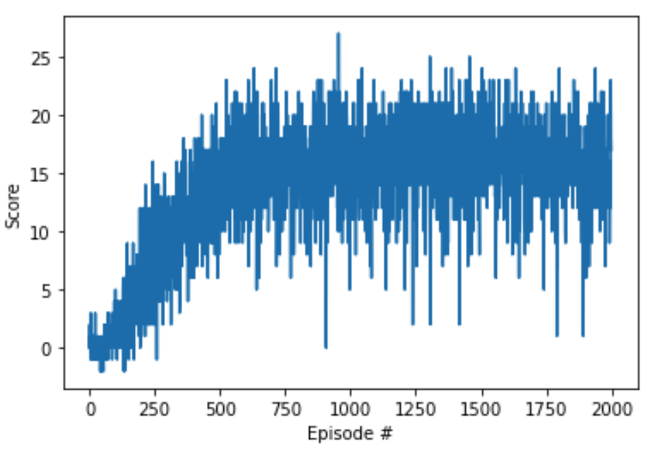
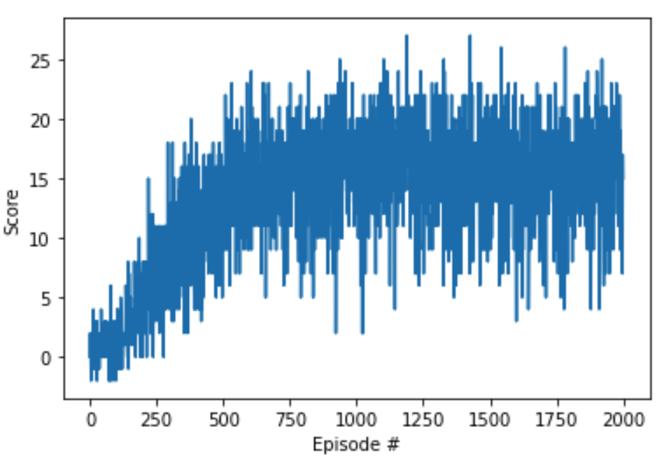
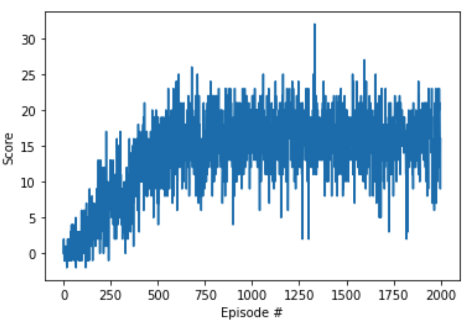
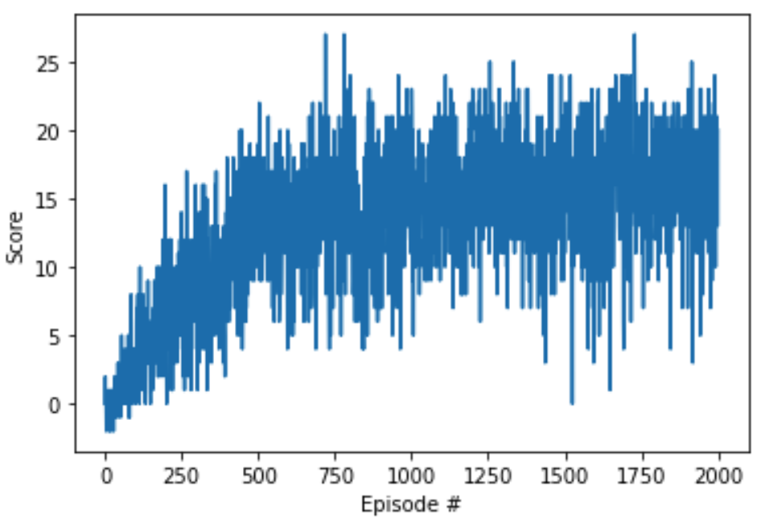
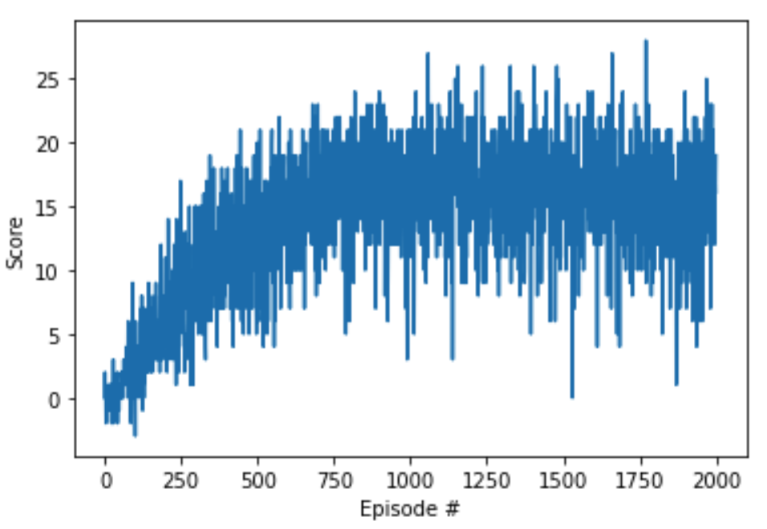

# Deep Reinforcement Learning Navigation
## OVERVIEW
##### Wednesday, June 3, 2020

The report is for Udacity Deep Reinforcement learning course to train an agent to navigate and collect bananas in a large, square world. A reward of +1 is provided for collecting a yellow banana, and a reward of -1 is provided for collecting a blue banana. Thus, the goal of your agent is to collect as many yellow bananas as possible while avoiding blue bananas.The Project get an average score of +13 over 100 consecutive episodes.

#### Algorithm
I implement the Deep Q Network (DQN) algorithm following the [Human-level control through deep reinforcement learning](https://storage.googleapis.com/deepmind-media/dqn/DQNNaturePaper.pdf)
and DQN coding exercise.DQN combines off-policy training and bootstrapping from traditional Q-learning with function approximation using neural networks.  This makes if very effective at learning even in high dimensional continuous state spaces.

When the agent interacts with the environment, the sequence of experience can be highly correlated. "Experience Replay" is effective method to prevent action values from oscillating or diverging catastrophically.Fixed-Q targets use a second neural "qnetwork_target" to estimate TD target that do not change weights as quickly as the "qnetwork_local" . Both networks are initialized by "class QNetwork"

I also implement enhancements[Double DQN](https://arxiv.org/pdf/1509.06461.pdf) , The idea of Double Q-learning is to reduce overestimations by decomposing the max operation in the target into action
selection and action evaluation.


#### Neural network model

    The neural network model as function approximation consists of tree fully connected linear layers Activation fucntion is relu. The hyperparameters are set as following.

```
BUFFER_SIZE = int(1e5)   #replay buffer size
BATCH_SIZE = 64          #minibatch size
GAMMA = 0.99             #discount factor
TAU = 1e-3               #for soft update of target parameters
LR = 5e-4                #learning rate
UPDATE_EVERY = 4         #how often to update the network
```

Fully connected linear units set as 128 
```
fc1_units = 128     
fc2_units = 128     
```

Fully connected linear units set as 64 
```
fc1_units = 64     
fc2_units = 64     
```

Fully connected linear units set as 32
```
fc1_units = 32      
fc2_units = 32      
```

Fully connected linear units set as 16
```
fc1_units = 16
fc2_units = 16
```
#### Results
The results are the average number of episodes required to solve the environment. 


|  FC units  |   DQN (episodes) | average Score | Double DQN (episodes) | average Score |
|------------|------------------|---------------|-----------------------|---------------|
|  (256 256) |  558             | 13.06         |  426                  | 13.02         |
|  (128 128) |  435             | 13.00         |  **431**              | **13.02**     |
|  (64 64)   |  444             | 13.02         |  387                  | 13.00         |
|  (32 32)   |  440             | 13.20         |  429                  | 13.01         |
|  (16 16)   |  418             | 13.00         |  473                  | 13.04         |

FC units (256 256)
Solved in 7 episodes!	Score: 14.0 |  Solved in 1 episodes!	Score: 15.0
:-------------------------:|:-------------------------:
  |  

FC units (128 128)
Solved in 1 episodes!	Score: 13.0 |  Solved in 1 episodes!	Score: 13.0
:-------------------------:|:-------------------------:
  |  

FC units (64 64)
Solved in 2 episodes!	Score: 20.0   |  Solved in 1 episodes!	Score: 20.0
:-------------------------:|:-------------------------:
  |  

FC units (32 32)
Solved in 2 episodes!	Score: 20.0   |  Solved in 1 episodes!	Score: 16.0
:-------------------------:|:-------------------------:
  |  

FC units (16 16)
Solved in 1 episodes!	Score: 15.0 |  Solved in 3 episodes!	Score: 15.0
:-------------------------:|:-------------------------:
  |  

#### Conclusion
The number of FC units will affect the performance of agents. In this experiment, setting 128*128 is the best effect. If greater than 256*256, the effect is not significantly improved.

#### Future enhancements
I implement "(Optional) Challenge: Learning from Pixels" using CNNs model. The training is slow by GPU. I could use AWS to train the model , and implement some of the more effective DQN modification like [Rainbow](https://arxiv.org/pdf/1710.02298.pdf)
